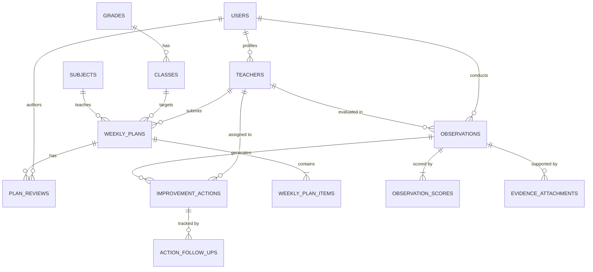

# Relational Database Schema & Data Architecture
## Smart Educational Supervision Platform (منصة الإشراف التربوي الذكي)

This document defines the relational schema bridging **Classera (LMS)**, **Microsoft OneDrive / 365 (Files & Documents)**, and the **Supervision Workflow Layer**.

---

## 1. Entity Relationship Diagram (Conceptual)

---

## 2. Table Specifications

### 2.1. `users` & `roles`
*   `id` (UUID / INT PK)
*   `national_id` (VARCHAR(10) UNIQUE)
*   `full_name` (VARCHAR(150))
*   `email` (VARCHAR(120) UNIQUE)
*   `role_code` (ENUM: `teacher`, `supervisor`, `academic_leader`, `principal`, `admin`)
*   `school_branch` (VARCHAR(100)) - e.g. "ثانوي بنين", "المسار الدولي"
*   `created_at` (TIMESTAMP)

### 2.2. `teachers`
*   `id` (INT PK)
*   `user_id` (INT FK -> `users.id`)
*   `employee_code` (VARCHAR(20) UNIQUE) - e.g. "AC-8841"
*   `specialization` (VARCHAR(100))
*   `department` (VARCHAR(100))
*   `status` (ENUM: `active`, `needs_support`, `under_review`)
*   `performance_index` (DECIMAL(5,2)) - e.g. 94.5%
*   `onedrive_portfolio_url` (VARCHAR(500)) - External deep link to MS 365
*   `classera_teacher_id` (VARCHAR(50)) - External LMS ID

### 2.3. `weekly_plans` & `weekly_plan_items`
*   `weekly_plans`:
    *   `id` (INT PK)
    *   `teacher_id` (INT FK -> `teachers.id`)
    *   `subject_id` (INT FK -> `subjects.id`)
    *   `grade_class_id` (INT FK -> `classes.id`)
    *   `week_number` (INT) - e.g. Week 4
    *   `term` (INT) - Term 1 / 2 / 3
    *   `date_start` (DATE) & `date_end` (DATE)
    *   `monthly_value_theme` (VARCHAR(150)) - e.g. "قيمة الانضباط والمسؤولية"
    *   `status` (ENUM: `draft`, `submitted`, `under_review`, `needs_revision`, `approved`)
    *   `onedrive_doc_url` (VARCHAR(500))
    *   `submitted_at` (TIMESTAMP)
*   `weekly_plan_items` (Day-by-Day Lessons):
    *   `id` (INT PK)
    *   `plan_id` (INT FK -> `weekly_plans.id`)
    *   `day_of_week` (ENUM: `Sunday`, `Monday`, `Tuesday`, `Wednesday`, `Thursday`)
    *   `period_number` (INT)
    *   `lesson_title` (VARCHAR(200))
    *   `targeted_skills` (TEXT)
    *   `homework_assignment` (TEXT)
    *   `classera_activity_url` (VARCHAR(500))
    *   `assessment_type` (ENUM: `quiz`, `formative_task`, `project`, `performance_task`)

### 2.4. `plan_reviews` (Revision & Approval Cycle)
*   `id` (INT PK)
*   `plan_id` (INT FK -> `weekly_plans.id`)
*   `supervisor_user_id` (INT FK -> `users.id`)
*   `decision` (ENUM: `approved`, `needs_revision`, `comments_added`)
*   `feedback_notes` (TEXT)
*   `completeness_score` (INT) - out of 100
*   `ai_check_summary` (JSON) - e.g. missing homework in Day 3, no targeted skill in Day 5
*   `created_at` (TIMESTAMP)

### 2.5. `classroom_observations` & `observation_scores`
*   `classroom_observations`:
    *   `id` (INT PK)
    *   `teacher_id` (INT FK -> `teachers.id`)
    *   `supervisor_id` (INT FK -> `users.id`)
    *   `visit_date` (DATE) & `visit_period` (INT)
    *   `lesson_topic` (VARCHAR(200))
    *   `total_score` (INT) - 0 to 100
    *   `rating_label` (VARCHAR(50)) - "ممتاز مرتفع", "ممتاز", "جيد جداً"
    *   `strengths` (TEXT)
    *   `areas_for_improvement` (TEXT)
    *   `supervisor_recommendations` (TEXT)
    *   `status` (ENUM: `scheduled`, `in_review`, `approved_and_shared`)
*   `observation_scores` (Rubric Breakdown):
    *   `domain_1_planning` (INT 0-20)
    *   `domain_2_teaching_strategies` (INT 0-30)
    *   `domain_3_classroom_management` (INT 0-25)
    *   `domain_4_assessment_feedback` (INT 0-25)

### 2.6. `improvement_actions` & `follow_ups` (Action Closure Cycle)
*   `improvement_actions`:
    *   `id` (INT PK)
    *   `observation_id` (INT FK -> `classroom_observations.id`)
    *   `teacher_id` (INT FK -> `teachers.id`)
    *   `supervisor_id` (INT FK -> `users.id`)
    *   `identified_problem` (TEXT) - e.g. "قلة توظيف استراتيجيات التعلم النشط"
    *   `measurable_action` (TEXT) - e.g. "تطبيق استراتيجية التعلم التعاوني وفكر-زاوج-شارك في حصتين موثقتين"
    *   `deadline_date` (DATE)
    *   `status` (ENUM: `pending`, `in_progress`, `completed`, `closed_verified`)
    *   `evidence_url` (VARCHAR(500)) - OneDrive / Classera link
*   `action_follow_ups`:
    *   `id` (INT PK)
    *   `action_id` (INT FK -> `improvement_actions.id`)
    *   `verified_by_supervisor_id` (INT FK -> `users.id`)
    *   `verification_date` (DATE)
    *   `verification_notes` (TEXT)
    *   `outcome` (ENUM: `satisfactory_closed`, `extended_deadline`, `escalated_to_leadership`)

---

## 3. Integration Interface Points

| System | Role in Supervision | Integration Mechanism |
| :--- | :--- | :--- |
| **Classera** | LMS & Online Lesson Activities | URL deep linking + simulated API connector for homework & quizzes |
| **OneDrive / 365** | Teaching Plans & Portfolio Files | Deep links to `.docx` / `.xlsx` + OneDrive folder embeds |
| **Our Supervision Layer** | Plan Review $\rightarrow$ Observations $\rightarrow$ Actions $\rightarrow$ Analytics | Central relational repository & AI Assistant |
